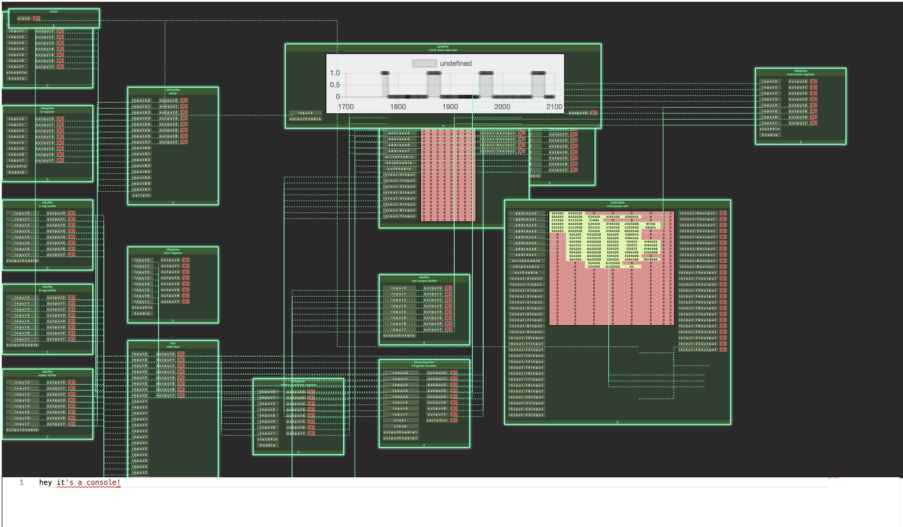

# 8chipsimulator
8 bit computer simulator




to build run 
```
npm install
npm install browserify -g
```
`tsc`
`browserify main.js -o output.js`

to run tests run:
`./node_modules/mocha/bin/mocha`

to run build, browserify and test - run

`npm run build`


to build and inject into global variable run 
`npm run buildGlobal` (recommended if you want to use the console)


### TODO...
- [ ] ClockView with button for clockmode, clock step, speed (mirror physical design).
- [x] GraphView part which can graph all values of input to a register etc - useful for visual debugging directly in application.
- [x] improve graphing part so it can graph multiple inputs side by side.

- [x] Revist simulator update mechanism, should use a scheduler of tasks which are generated via other tasks, as opposed to running everything every time step in topological order.
- [ ] instead of manually freshing the partModels so view updates - we should tie that view update to the model update by registerting as a callback on the update method of the model. - need to make sure this does not introduce a memory leak.
- [ ] finish connecting modules of computer.
- [ ] implement flags register and microcode.
- [x] use a nBuffer to show all control signals / or groups of signals.
- [ ] interface for wire connections/part addition.
- [x] add a console to main window - any part name constructor can be invoked and the part will be added.
- [ ] add autocomplete to console.
- [ ] generate verilog code from circuit.
- [ ] some minimal assembly programs.
- [ ] full computer tests.
- [ ] 
